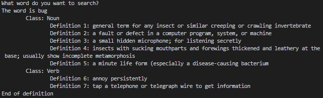

# Python_SpeechDictionary

SpeechDictionary allows you to find definitions for a word. 

The application uses the SpeechRecognition module to identify the word to be defined spoken by the user. The PyDictionary module is used to find the definition of the word and the pyttsx3 library to translate texts into speech.

